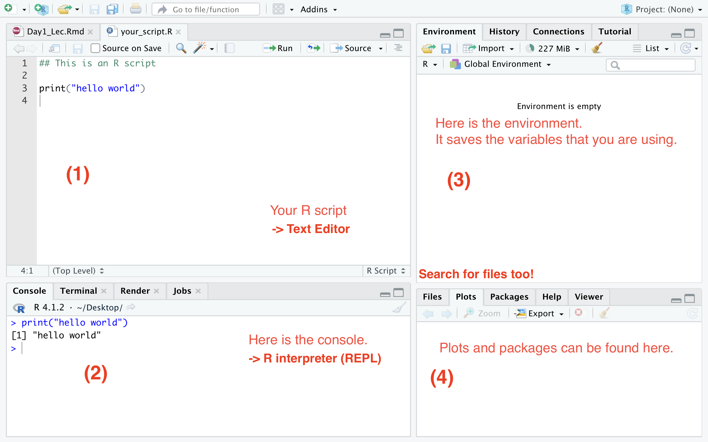

```{r setup, include=FALSE}
knitr::opts_chunk$set(echo = TRUE)
def.chunk.hook  <- knitr::knit_hooks$get("chunk")
knitr::knit_hooks$set(chunk = function(x, options) {
  x <- def.chunk.hook(x, options)
  ifelse(options$size != "normalsize", paste0("\n \\", options$size,"\n\n", x, "\n\n \\normalsize"), paste0("\n \\", "footnotesize","\n\n", x, "\n\n \\normalsize"))
})
```

# The R Studio User Interface

- RStudio is an integrated development environment (IDE) designed for R

- **4 panes**:

<p>
{width=50%}
</p>
  

# R Console
- R console is the R interpreter itself 
- Execute code by typing on this console screen directly
- The normal prompt `>` denotes that R is ready for the new input. 

# R as a calculator: Basic numerical operations

```{r}
2 + 3
2 * 3 # asterisk
4 - 1 # subtraction
6 / 4 # slash
```

# R as a calculator: Basic numerical operations
```{r}
2 ^ 3 # caret 
2 ** 3
# '^'(2,3)
```

# R as a calculator: Basic numerical operations
```{r}
3 + 3 * 20
(3 + 3) * 20
```

# Incomplete Commands 

- If you type an incomplete command and press Enter, R will display a `+` prompt
- Either finish the command or hit Escape to start over:

**console example**
```{r eval=F}
> 5 -
+
+ 1
[1] 4
```

# Errors 

- When R recognizes **Errors**, then it **stops** executing the code and will return an error message. 

```{r eval = F}
> 3 % 5
Error: unexpected input in "3 % 5"
>
# Here the user is trying to do modulus in R, but fails to use the correct
# operator for modulus %%.
```

# Warnings

- When you encounter **Warnings**, R usually finishes execution, but she wants to tell you that there are somethings you might want to take a look. Here is an example.
```{r eval=F}
setwd("~/")
Warning message:
In in_dir(input_dir(), expr) :
  You changed the working directory to ~/ 
  (probably via setwd()). 
  It will be restored to the default working directory. 
  See the Note section in ?knitr::knit
```


# Comments in R 

- Comments are always helpful for humans (and LLMs)
- A single comment is written using `#` in the beginning of the statement.
- There is no multiline comments support. 

```{r}
# This is a comment.
## This is also a comment.
### This is still a comment.
### Comment again. #######
```

- Multiple Comments: Block select the lines and then,
  - On Windows and Linux, Ctrl + Shift + C.
  - On macOS, Cmd + Shift + C.


# \textcolor{red}{In-class exercises:}

Let's try doing these simple tasks. If you execute everything correctly, you 
should end up with the same number that you started with:

1. Choose any number and add 2 to it.
2. Multiply the result by 3.
3. Subtract 6 from the answer.
4. Divide what you get by 3.

# \textcolor{red}{In-class exercises:}
```{r}
3 + 2 # add 2
5 * 3 # multiply by 3
15 - 6 # substract 6
9 / 3 # divide by 3
```


# R Objects

- How to create objects
- Data types
- Data structures

# Creating an Object
- We can give names that can carry meanings

```{r}
a <- 3
print(a)
print(class(a))
```

- *Assign* values by using two operators: `<-` and `=`. 
- However, `=` is usually reserved to be used inside functions. 
- R automatically detect types

# Five Basic Data Types

There are **5** major data types in R. That said, most data you encounter will fall into these five categories. You can check the type of any object using the `class()` function.

1. Numeric (double)
2. Integer
3. Character
4. Logical
5. Factor

# Numeric (Double)

- Default for any number
- Includes decimals (floats)

```{r}
weight <- 70.25
print(weight)
print(class(weight))
```

# Integer

- Whole numbers can be contained as integer. 
- In R, you must add `L` suffix to force numbers to be integer
- Rarely used?

```{r}
# Naive assignment - Numeric
height_num <- 6
print(class(height_num))

# Force it to be integer 
height_int <- 6L
print(class(height_int))
```


# Character (Strings)

- Text data
- "double quotes" or 'single quotes'

```{r}
city <- "St. Louis"
print(class(city))
city <- 'St. Louis'
print(class(city))
```

# Logical (Boolean)
- `TRUE` and `FALSE`
- `TRUE = 1` `FALSE = 0` 
- `T` and `F`

```{r}
isNY <- city == "New York"
print(isNY)
isSTL <- city == "St. Louis"
print(isSTL)

print(isNY + isSTL)
```

# Factor (categorical values)
- Categories (e.g., "High", "Medium", "Low" or "Male", "Female")
- Integers with labels(levels)

```{r}
gender <- factor(c("Male", "Female", "Female"))
class(gender) # Returns "factor"
levels(gender) # Shows the unique categories
```

# Data Structures

- Let's explore some of the major types (There are different data structures: `tibble`, `data.table`)
  1. Vector
  2. List
  3. Dataframe
  4. Matrix
  

# Vector

- Vector is a *list* of elements of the *same type*. 
- `c()` function.
- R is specialized in vector level operations


```{r}
# A numeric vector
heights <- c(150, 162, 180, 155)

# A character vector
colors <- c("red", "blue", "green")

# IMPORTANT: If you mix types, R will "coerce" them to the most flexible type (usually character)
mixed <- c(1, "apple", TRUE) 
class(mixed)
```

# List

- Group of *any kinds of* R objects
- `list()`
```{r}
list1 <- list(100:130, "R", list(TRUE, FALSE))
list1
```

# List Operations
- **double-bracketed indices** $\rightarrow$ *element*
- **single-bracket indices** $\rightarrow$ *sub-element*
```{r}
list1[[2]]
list1[2]
```

# \textcolor{red}{In-class exercises:}

1. Use a list to store a single playing card, like the ace of hearts, which has
   a point value of one. The list should save the face of the card, the suit,
   and the point value in separate elements.

# \textcolor{red}{In-class exercises:}

```{r}
card <- list("ace", "hearts", 1)
card
```

# Dataframe

- A data frame is a collection of vectors of the **same length**
- `data.frame(column_name = values)`

```{r}
df <- data.frame(HappyFace = c("ace", "two", "six"),
                 Suit = c("clubs", "clubs", "clubs"),
                 Value = c(1, 2, 3))
head(df)
```

# Dataframe

- `str()`: investigate structure
```{r}
typeof(df)
class(df)
str(df) #structure
```

# Example
```{r}
deck <- data.frame(
  face = c("king", "queen", "jack", "ten", "nine", "eight", "seven", "six",
    "five", "four", "three", "two", "ace", "king", "queen", "jack", "ten",
    "nine", "eight", "seven", "six", "five", "four", "three", "two", "ace",
    "king", "queen", "jack", "ten", "nine", "eight", "seven", "six", "five",
    "four", "three", "two", "ace", "king", "queen", "jack", "ten", "nine",
    "eight", "seven", "six", "five", "four", "three", "two", "ace"),
  suit = c("spades", "spades", "spades", "spades", "spades", "spades",
    "spades", "spades", "spades", "spades", "spades", "spades", "spades",
    "clubs", "clubs", "clubs", "clubs", "clubs", "clubs", "clubs", "clubs",
    "clubs", "clubs", "clubs", "clubs", "clubs", "diamonds", "diamonds",
    "diamonds", "diamonds", "diamonds", "diamonds", "diamonds", "diamonds",
    "diamonds", "diamonds", "diamonds", "diamonds", "diamonds", "hearts",
    "hearts", "hearts", "hearts", "hearts", "hearts", "hearts", "hearts",
    "hearts", "hearts", "hearts", "hearts", "hearts"),
  value = c(13, 12, 11, 10, 9, 8, 7, 6, 5, 4, 3, 2, 1, 13, 12, 11, 10, 9, 8,
    7, 6, 5, 4, 3, 2, 1, 13, 12, 11, 10, 9, 8, 7, 6, 5, 4, 3, 2, 1, 13, 12, 11,
    10, 9, 8, 7, 6, 5, 4, 3, 2, 1)
)
# View(deck) # This will open R studio stock viewer
```

# \textcolor{red}{In-class exercises:}

1. Create an empty dataframe named df.
2. Create a dataframe using the four given vectors. Name the dataframe df. 
3. Get the structure of df. 
4. Open df in the data viewer in R. 

# \textcolor{red}{In-class exercises:}

```{r}
# 2.
name = c('Anastasia', 'Dima', 'Katherine', 'James', 'Emily', 'Michael',
         'Matthew', 'Laura', 'Kevin', 'Jonas')
score = c(12.5, 9, 16.5, 12, 9, 20, 14.5, 13.5, 8, 19)
attempts = c(1, 3, 2, 3, 2, 3, 1, 1, 2, 1)
qualify = c('yes', 'no', 'yes', 'no', 'no', 'yes', 'yes', 'no', 'no', 'yes')

df <- data.frame(cbind(name,score,attempts,qualify))
df <- data.frame(name,score,attempts,qualify)
```


# Matrix
- Array
- `matrix(values, nrow and or ncol)` an
```{r}
die = 1:6
die
m <- matrix(die, nrow = 2, byrow = FALSE)
m
```

matrix will fill up the matrix column by column by default, but you can fill the
matrix row by row if you include the argument byrow = TRUE:
```{r}
m <- matrix(die, nrow = 2, byrow = TRUE) 
m
```

- You can also create a matrix by providing the numbers directly like this: 
```{r}
matrix(1,3,2) # This creates a 3 by 2 unit matrix
# (value, row, col)
matrix(0,4,3) # This creates a 4 by 3 zero matrix
```

# Matrix Operations
- There are few useful functions to manipulate matrices

# Checking the Dimension 
```{r}
A <- matrix(c(2,3,-2,1,2,2),3,2)
A
print(dim(A))
```
- Can also be used with datamframes
```{r}
df <- data.frame(names = c("charles", "amy"), age = c(15, 68))
print(dim(df))
```


# Multiplication by a Scalar
```{r}
3 * A
```


# Matrix Addition & Subtraction
```{r}
B <- matrix(c(1,4,-2,1,2,1),3,2)
A - B
A + B
```

# Matrix Multiplication
```{r}
C <- matrix(c(2,-2,1,2,3,1),2,3)
dim(C)
dim(A)
C %*% A 
A %*% C 
```


# Transpose of a Matrix
```{r}
A
t(A)
t(t(A))
```

# Inverse of a Matrix
```{r}
D <- matrix(c(4,4,-2,2,6,2,2,8,4),3,3)
D
solve(D)
```


# Determinant of a Matrix
```{r}
D
det(D)
```

# Horizontal Concatenation
```{r}
A
B
cbind(A,B)
```
- can also be used with dataframes and vectors


# Vertical Concatenation
```{r}
rbind(A,B)
```
- can also be used with dataframes and vectors


# \textcolor{red}{In-class exercises:}


1. Create a 3 by 3 identity matrix I.
2. Create another 3 by 3 matrix M with numbers 1 through 9, i.e. the first row
   should be 1, 2, 3, etc.
3. Print the diagonal of M. 
4. Multiply M by 10, and save the new matrix as N. 
5. Find the determinant of M. 
6. Transpose M. 
7. Does M have an inverse? If so, find the inverse of M. If not, explain why.


# Common Attributes 

- An attribute is a piece of information (metadata) that you can attach to R object 
- `attributes()`
- names, dimensions, and classes (data types)

```{r}
die <- 1:6
attributes(die)
# R uses NULL to represent the null set, an empty object.
# NULL is often returned by functions whose values are undefined.
# You can create a NULL object by typing NULL in capital letters.
```

# Names 
```{r}
names(die)
```
- NULL means that die does not have a names attribute. 

- You can given a "names" attribute to die like this: 
```{r}
# The vector should include one name for each element in die
names(die) <- c("one", "two", "three", "four", "five", "six")

# Now die has a names attribute
attributes(die)
head(die)
```

- To remove the names attribute, set it to NULL:
```{r}
names(die) <- NULL
names(die)
head(die)
```


# Dimension 

- 1-dimensional: `length()`.
```{r}
length(die)
```

- You can transform an atomic vector into an n-dimensional array by giving it a
dimensions attribute with `dim()`.

```{r}
dim(die) <- c(2, 3) # values by default added column-wise
head(die)
```

# Functions
- Take inputs, process these inputs, and return outputs
- Arguments is a value that you pass to a function (= inputs)
- Some examples: `round()` and `factorial()`

```{r}
# The following two functions come with base R.
# You do not need to install and load new packages to use them.
round(3.1415)
factorial(3)
```

# Functions
- R will work **from the innermost function to the outermost**.
```{r}
die <- 1:6
die
mean(1:6)
mean(die)
round(mean(die))
ceiling(mean(die)) # rounds up
floor(mean(die)) # rounds down
ceiling(4.000001)
floor(3.99999999)
```

# Function Arguments

- How do you know which argument names to use?
- `args()`

```{r}
args(round)
round(3.14, digits = 1)
args(ceiling)
args(floor)
```

# Function Arguments
- Functions may have default values: `digis=0`
- For example,
```{r n}
round(3.1415)
round(3.1415, digits = 2)
```

# Function Arguments
- If arguments names are not provided, R follows it
- If arguments names are not specified, R uses default order

```{r}
round(digits = 2, x = 3.1415) # reversed order, specify argument name
round(2, 3.1415) # R treat this as round(x = 2, digits=3.1415)
```
